# PolyEdge System Flow — Complete Technical Reference

> **Audience**: Engineers, AI agents, and operators who need to understand how every subsystem connects.
>
> **Conventions**: All diagrams use Mermaid syntax. File paths are relative to project root.

---

## 1. High-Level Architecture

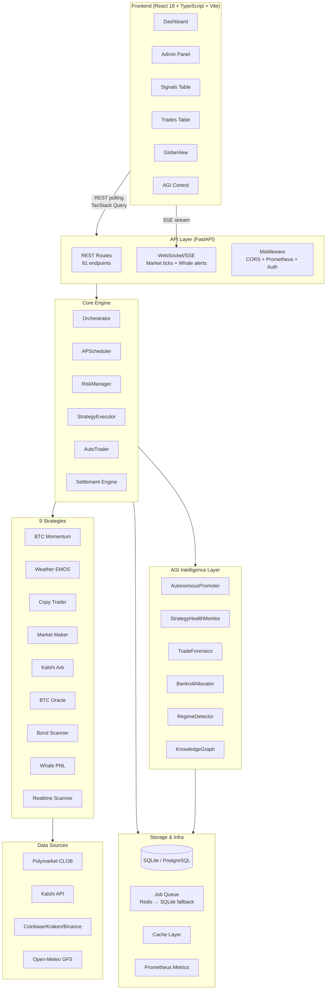

---

## 2. Startup Sequence

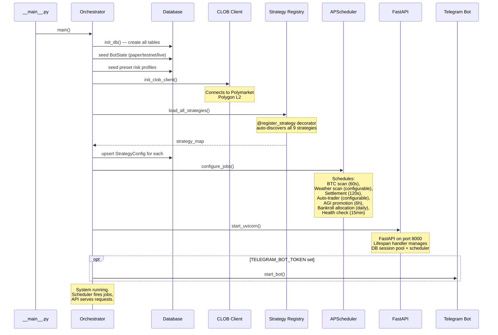

### Environment-Driven Feature Flags

| Flag | Default | Controls |
|------|---------|----------|
| `ACTIVE_MODES` | `paper` | Which modes run (comma-separated) |
| `SHADOW_MODE` | `false` | Observe-only, no trade execution |
| `AI_ENABLED` | `true` | Master toggle for AI signal analysis |
| `AUTO_TRADER_ENABLED` | `true` | Auto-execute high-confidence signals |
| `AGI_AUTO_PROMOTE` | `false` | Allow paper→live without human approval |
| `AGI_STRATEGY_HEALTH_ENABLED` | `true` | Auto-disable killed strategies |
| `AGI_BANKROLL_ALLOCATION_ENABLED` | `false` | Daily capital reallocation |
| `JOB_WORKER_ENABLED` | `false` | Redis/SQLite job queue |
| `WEATHER_ENABLED` | `true` | Weather market scanning |
| `KALSHI_ENABLED` | `false` | Kalshi platform integration |
| `WHALE_LISTENER_ENABLED` | `false` | Whale position tracking |
| `POLYMARKET_WS_ENABLED` | `true` | Real-time market data via WebSocket |

---

## 3. Signal Generation Flow

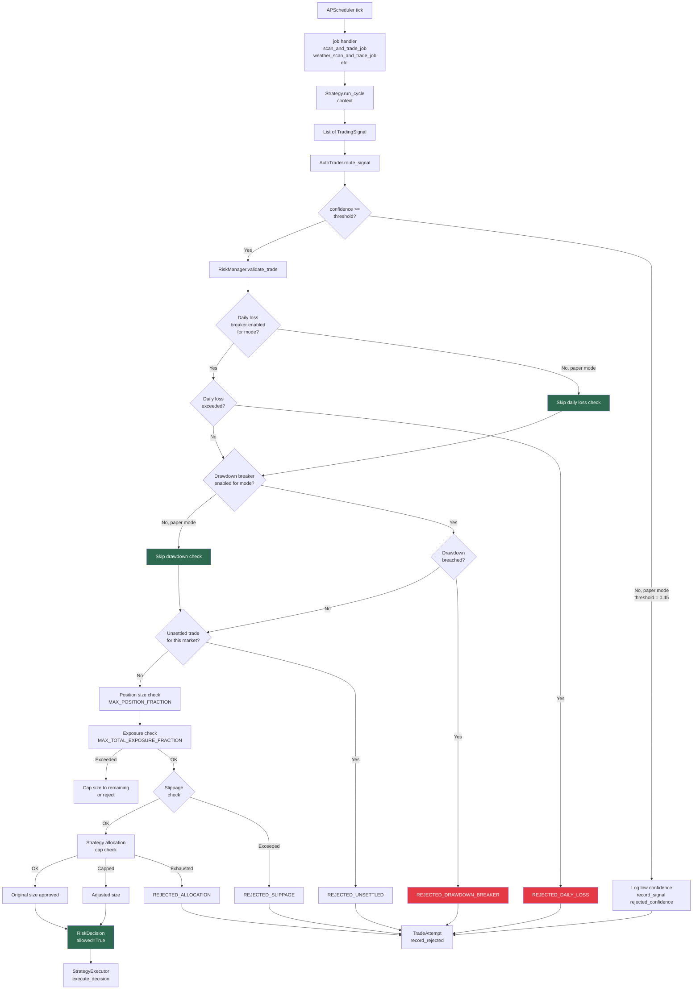

### Per-Mode Breaker Configuration

| Mode | Drawdown Breaker | Daily Loss Limit | Confidence Threshold | Min Order |
|------|-----------------|-------------------|---------------------|-----------|
| **paper** | ❌ Disabled | ❌ Disabled | 0.45 (relaxed) | $1 |
| **testnet** | ✅ Enabled | ✅ Enabled | AUTO_APPROVE_MIN_CONFIDENCE | $5 |
| **live** | ✅ Enabled | ✅ Enabled | AUTO_APPROVE_MIN_CONFIDENCE | $5 |
| **shadow** | N/A (no trades) | N/A (no trades) | N/A | N/A |

Configurable via `DRAWDOWN_BREAKER_ENABLED_PER_MODE` and `DAILY_LOSS_LIMIT_ENABLED_PER_MODE` dicts.

---

## 4. Trade Execution Flow

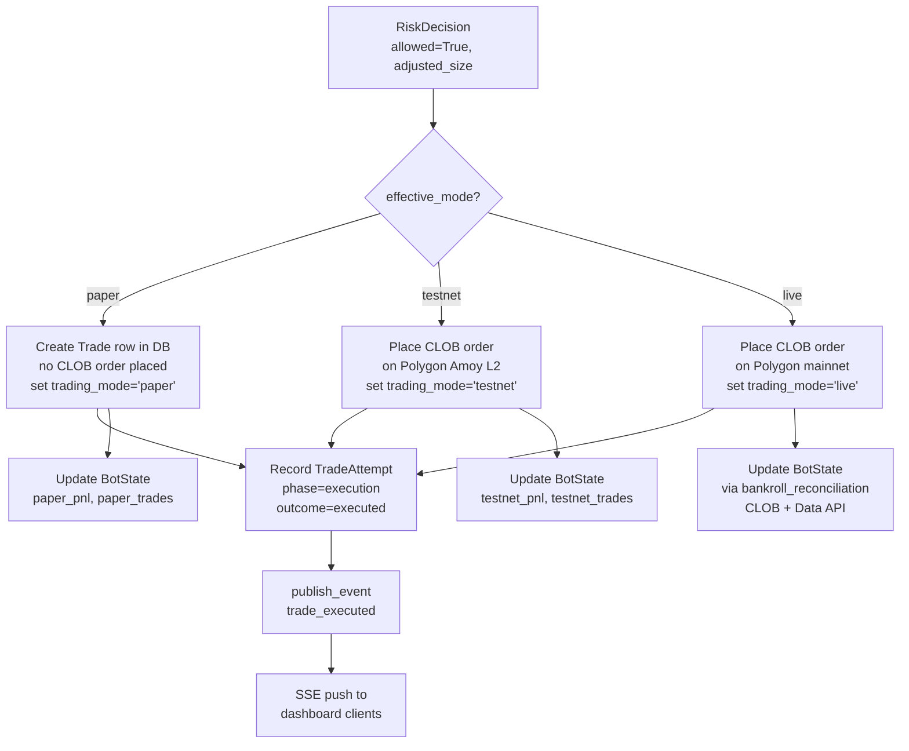

### Bankroll Source of Truth (ADR-002)

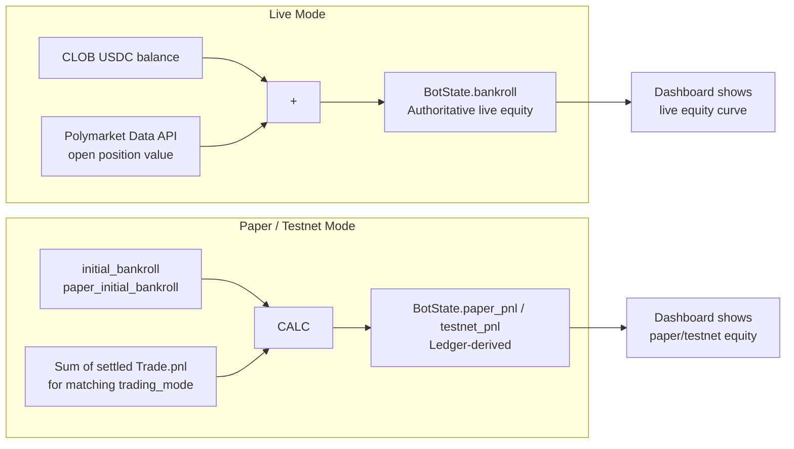

> **Critical**: Never recompute live equity from local ledger. Live `BotState.bankroll` and `total_pnl` come from external sources only. See `docs/architecture/adr-002-live-equity-source.md`.

---

## 5. Settlement Engine

```mermaid
flowchart TD
    SCHED[settlement_job<br/>runs every 120s] --> FETCH[Fetch resolved markets<br/>from Gamma API + Data API]
    
    FETCH --> MATCH[Match unresolved Trade rows<br/>to market outcomes]
    
    MATCH --> OUTCOME{Outcome available?}
    OUTCOME -->|No| WAIT[Skip — retry next cycle]
    OUTCOME -->|Yes| PNL[Calculate PnL per trade]
    
    PNL --> DIR{Trade direction<br/>vs outcome}
    DIR -->|direction='up'<br/>outcome=1.0| WIN[PnL = (1 - entry_price) × size]
    DIR -->|direction='up'<br/>outcome=0.0| LOSS[PnL = -entry_price × size]
    DIR -->|direction='down'<br/>outcome=0.0| LOSS
    DIR -->|direction='down'<br/>outcome=1.0| WIN2[PnL = (1 - entry_price) × size<br/>(went down, we bet down)]
    
    WIN --> SETTLE[Mark Trade.settled=True<br/>Set Trade.pnl and result]
    LOSS --> SETTLE
    WIN2 --> SETTLE
    
    SETTLE --> UPDATE[Update BotState totals:<br/>total_pnl, winning_trades]
    UPDATE --> FORENSICS{Trade.pnl < 0?}
    FORENSICS -->|Yes| ANALYZE[TradeForensics.analyze_losing_trade<br/>Diagnose root cause]
    FORENSICS -->|No| SKIP3[Continue]
    
    ANALYZE --> HEALTH[StrategyHealthMonitor.assess<br/>Update strategy health metrics]
    HEALTH --> KILL{Health status = 'killed'?}
    KILL -->|Yes| DISABLE[Auto-disable strategy<br/>in StrategyConfig]
    KILL -->|No| CONTINUE[Continue]
    
    DISABLE --> EVENT2[publish_event settlement_completed]
    CONTINUE --> EVENT2
    SKIP3 --> EVENT2
    EVENT2 --> SSE2[SSE push to dashboard]
```

---

## 6. AGI Autonomy & Experiment Lifecycle

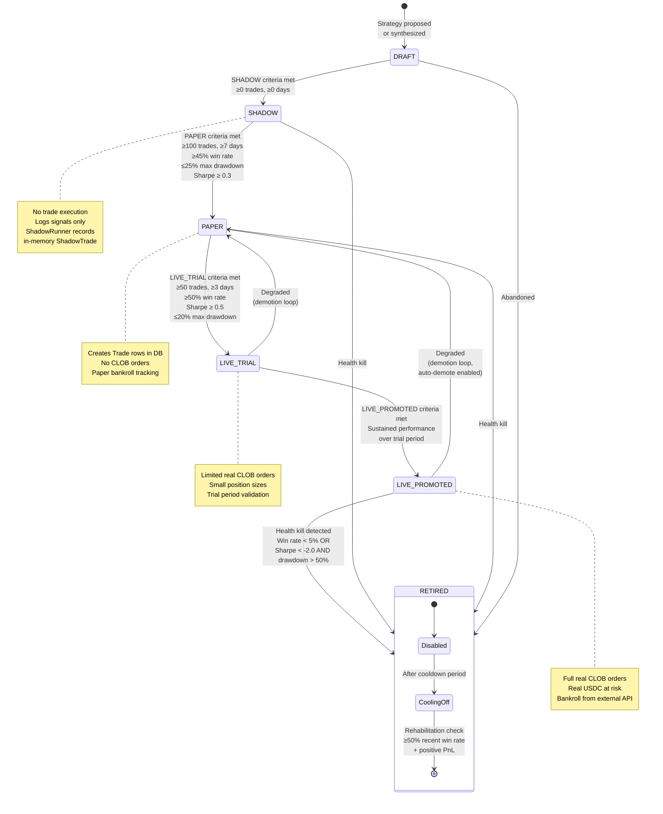

### Full Promotion Pipeline: DRAFT → SHADOW → PAPER → LIVE_TRIAL → LIVE_PROMOTED

The AGI experiment lifecycle follows a five-stage promotion pipeline with demotion loops:

1. **DRAFT** — Strategy proposed by human or synthesized by `StrategySynthesizer`. No trade execution. Must pass 4-gate validation before entering SHADOW.
2. **SHADOW** — Signal logging only; `ShadowRunner` records in-memory `ShadowTrade` objects. The `shadow_validation_job` recalculates per-genome fitness from settled shadow trades, syncs `GenomePerformance`, and evaluates stage gates for promotion to PAPER.
3. **PAPER** — Creates `Trade` rows in DB with simulated bankroll. No CLOB orders. Strategies that degrade from LIVE_TRIAL or LIVE_PROMOTED are demoted back here with parameter improvement via `ForensicsIntegration`.
4. **LIVE_TRIAL** — Limited real CLOB orders with small position sizes. Validates that strategy performance translates from paper to live conditions.
5. **LIVE_PROMOTED** — Full real CLOB orders with real USDC at risk. Bankroll sourced from external CLOB + Data API (ADR-002).

**Demotion loop**: LIVE_PROMOTED → PAPER (if auto-demote enabled and health degrades). Demoted strategies receive parameter overhaul via `ForensicsIntegration._has_active_experiment()` which excludes RETIRED genomes.

### Genome Evolution Pipeline

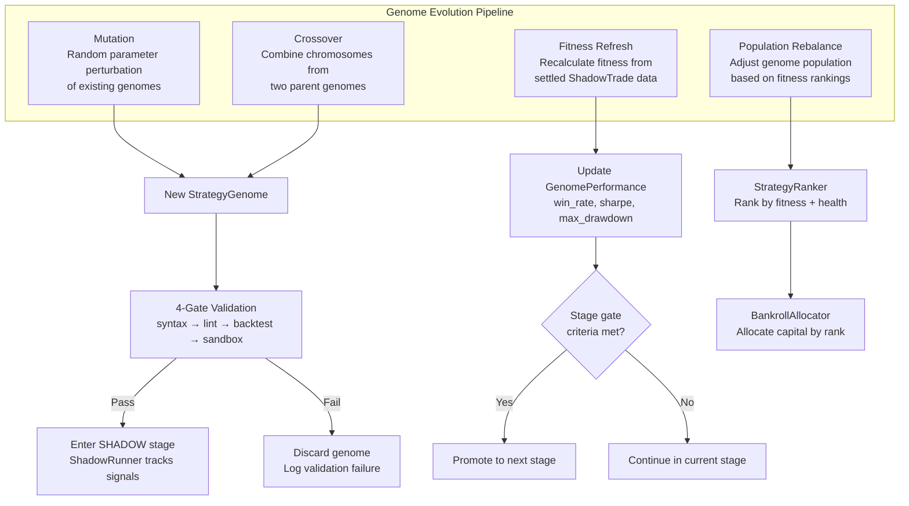

The genome evolution pipeline (`backend/application/strategy/genome_compiler.py`, `backend/application/strategy/genome_strategy.py`) operates as follows:

- **Mutation**: Random perturbation of existing genome chromosomes (entry, exit, risk, execution parameters)
- **Crossover**: Combines chromosomes from two parent genomes to produce offspring
- **Fitness Refresh**: `shadow_validation_job` recalculates per-genome fitness from settled `ShadowTrade` records, syncing `GenomePerformance` metrics
- **Population Rebalance**: `StrategyRanker` adjusts the active genome population based on fitness rankings, culling underperformers and promoting strong candidates

### 4-Gate Strategy Synthesis Validation

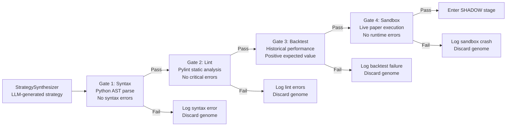

The `StrategySynthesizer` (`backend/core/strategy_synthesizer.py`) uses LLM-powered strategy generation with a 4-gate validation pipeline. Only strategies that pass all four gates (syntax → lint → backtest → sandbox) enter the SHADOW stage. Failed genomes are discarded with detailed validation logs.

### Shadow-Trade Fitness Feedback Loop

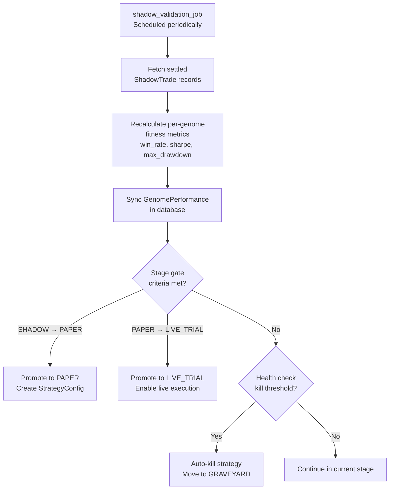

The `shadow_validation_job` (`backend/application/agi/evolution_jobs.py`) is the canonical shadow-trade feedback loop. It recalculates per-genome fitness from settled `ShadowTrade` records, syncs `GenomePerformance`, promotes SHADOW→PAPER and PAPER→LIVE_TRIAL by metric gates, and auto-kills terminal performers to GRAVEYARD.

### Model Calibration Drift Check

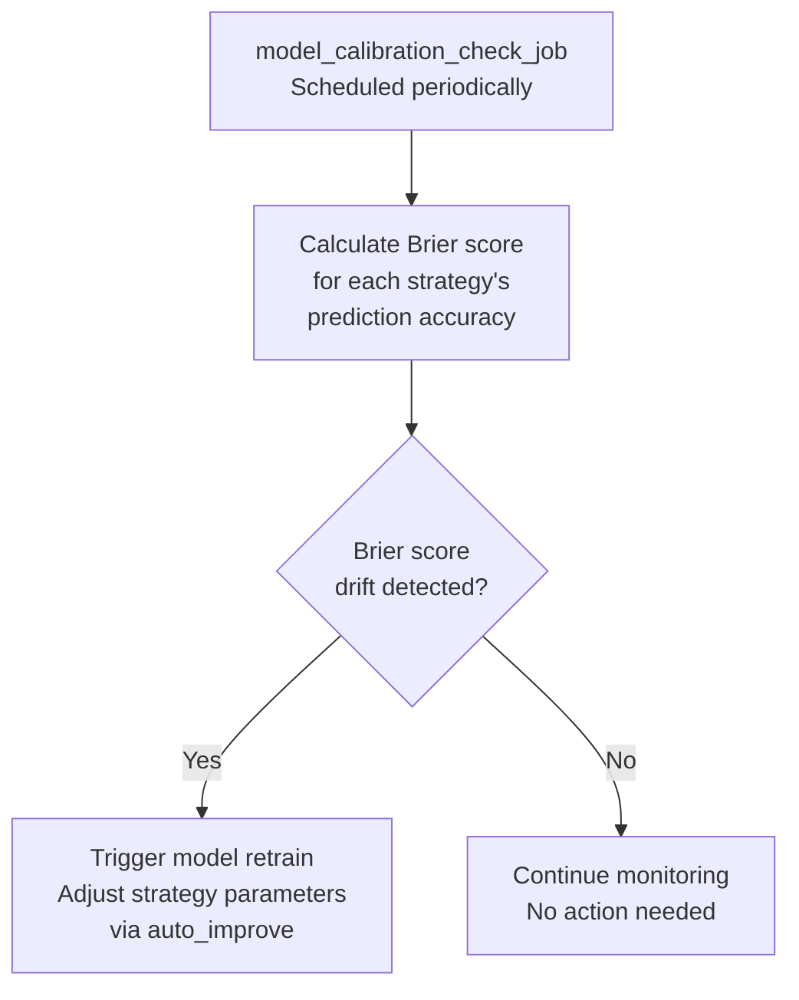

The `model_calibration_check_job` (`backend/core/agi_jobs.py`) monitors prediction accuracy drift using Brier scores. When drift exceeds thresholds, it triggers model retraining and parameter adjustment via `auto_improve`.

### Autonomous Daemons

```mermaid
flowchart TD
    subgraph Scheduled_Jobs["APScheduler Jobs"]
        P6[autonomous_promotion_job<br/>every 6h]
        D[bankroll_allocation_job<br/>daily]
        H[health_check_job<br/>every 15min]
        N[nightly_review_job<br/>daily at 2am]
        S[settlement_job<br/>every 120s]
        BTC2[btc_scan_and_trade_job<br/>every 60s]
        WX[weather_scan_and_trade_job<br/>configurable]
        SV[shadow_validation_job<br/>periodic]
        MC[model_calibration_check_job<br/>periodic]
    end
    
    P6 --> PROM[AutonomousPromoter]
    PROM --> EVAL[Evaluate all experiments<br/>against stage criteria]
    EVAL --> PROMOTE[Promote passing<br/>experiments]
    EVAL --> RETIRE[Retire failing<br/>experiments]
    
    D --> ALLOC2[BankrollAllocator]
    ALLOC2 --> RANK[StrategyRanker.auto_allocate]
    RANK --> WRITE[Write allocations to<br/>BotState.misc_data]
    
    H --> AGI Health
    AGI Health[AGIHealthCheck]
    AGI Health --> CHECK[Validate strategy staleness,<br/>data freshness, budget,<br/>scheduler, orphans]
    
    N --> REVIEW[NightlyReview]
    REVIEW --> LOG2[Write markdown log<br/>to docs/agi-log/]
    
    SV --> FITNESS[Recalculate genome fitness<br/>from ShadowTrade data]
    FITNESS --> SYNC_PERF[Sync GenomePerformance]
    SYNC_PERF --> GATE_EVAL[Evaluate stage gates<br/>for promotion/demotion]
    
    MC --> BRIER[Calculate Brier scores<br/>Check calibration drift]
    BRIER --> DRIFT_CHECK{Drift detected?}
    DRIFT_CHECK -->|Yes| RETRAIN[Trigger model retrain<br/>via auto_improve]
    DRIFT_CHECK -->|No| MONITOR[Continue monitoring]
```

### Promotion Gate Criteria

| Transition | Min Trades | Min Days | Win Rate | Sharpe | Max Drawdown |
|-----------|-----------|----------|----------|--------|-------------|
| DRAFT → SHADOW | 0 | 0 | — | — | — |
| SHADOW → PAPER | 100 | 7 | ≥45% | ≥0.3 | ≤25% |
| PAPER → LIVE_TRIAL | 50 | 3 | ≥50% | ≥0.5 | ≤20% |
| LIVE_TRIAL → LIVE_PROMOTED | — | — | Sustained performance | — | — |
| Kill (any mode) | — | — | <5% | <−2.0 AND | >50% |

> **Note**: Crazy-tier strategies skip the 14-day minimum via `_get_strategy_risk_tier()` in `fronttest_validator.py`.

---

## 7. Risk Management — Detailed

```mermaid
flowchart TD
    subgraph Config_Layer["Configuration Layer"]
        CFG1[DRAWDOWN_BREAKER_ENABLED_PER_MODE<br/>paper: false, testnet: true, live: true]
        CFG2[DAILY_LOSS_LIMIT_ENABLED_PER_MODE<br/>paper: false, testnet: true, live: true]
        CFG3[MAX_POSITION_FRACTION: 0.08<br/>MAX_TOTAL_EXPOSURE_FRACTION: 0.70<br/>SLIPPAGE_TOLERANCE: 0.02]
        CFG4[Risk Profiles<br/>safe / normal / aggressive / extreme<br/>Override all thresholds at runtime]
        CFG5[AUTO_APPROVE_MIN_CONFIDENCE: 0.50<br/>PAPER threshold: 0.45]
    end
    
    subgraph Validation_Order["RiskManager.validate_trade() Validation Order"]
        step1[1. Confidence check<br/>paper: 0.45, others: AUTO_APPROVE_MIN_CONFIDENCE]
        step2[2. Daily loss limit<br/>SKIPPED if breaker disabled for mode]
        step3[3. Drawdown breaker<br/>SKIPPED if breaker disabled for mode]
        step4[4. Unsettled trade check<br/>No re-entry on same market]
        step5[5. Position size cap<br/>live: available_cash × MAX_POSITION_FRACTION<br/>paper: bankroll × MAX_POSITION_FRACTION]
        step6[6. Total exposure limit<br/>live: bankroll × MAX_TOTAL_EXPOSURE_FRACTION<br/>paper: (bankroll + exposure) × fraction]
        step7[7. Slippage tolerance<br/>Reject if slippage > SLIPPAGE_TOLERANCE]
        step8[8. Strategy allocation cap<br/>From BankrollAllocator]
        
        step1 --> step2 --> step3 --> step4 --> step5 --> step6 --> step7 --> step8
    end
    
    Config_Layer --> Validation_Order
    
    step8 --> RESULT[RiskDecision<br/>allowed, reason, adjusted_size]
```

### Drawdown Breaker Internals

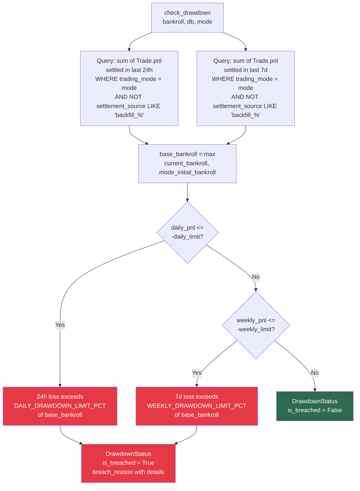

---

## 8. Frontend Architecture

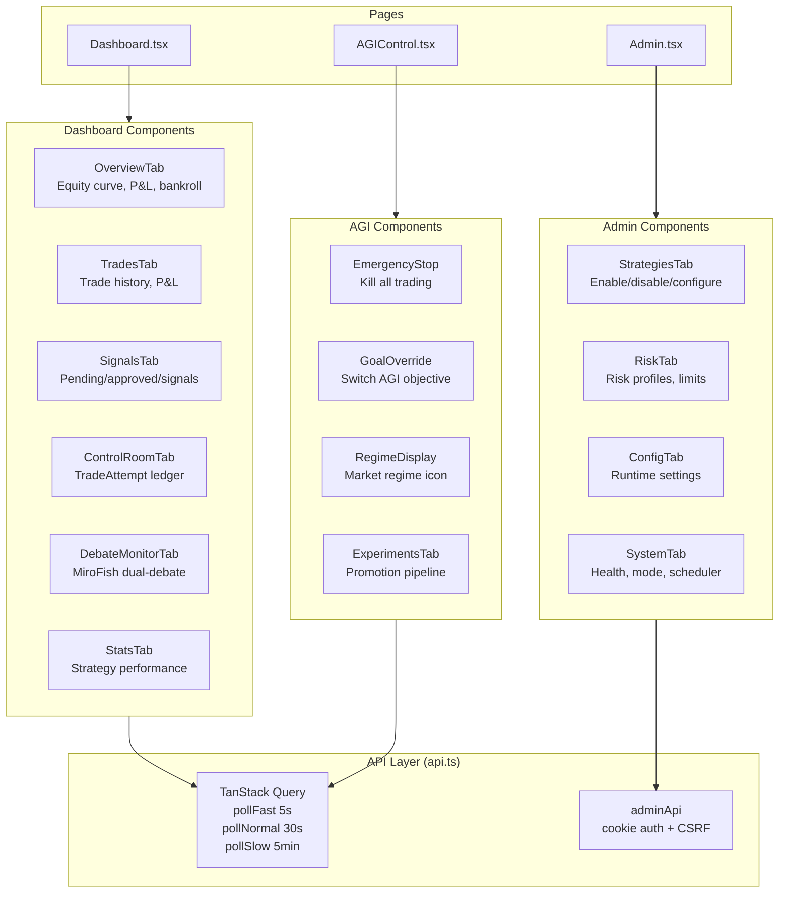

### Polling Intervals

| Hook | Default | Used For |
|------|---------|----------|
| `VITE_POLL_FAST_MS` | 5000 | Trade updates, signal status |
| `VITE_POLL_NORMAL_MS` | 30000 | Dashboard overview, equity |
| `VITE_POLL_SLOW_MS` | 300000 | Strategy config, system status |
| `VITE_POLL_VERY_SLOW_MS` | 600000 | AGI experiments, promotion state |

### Auth Flow

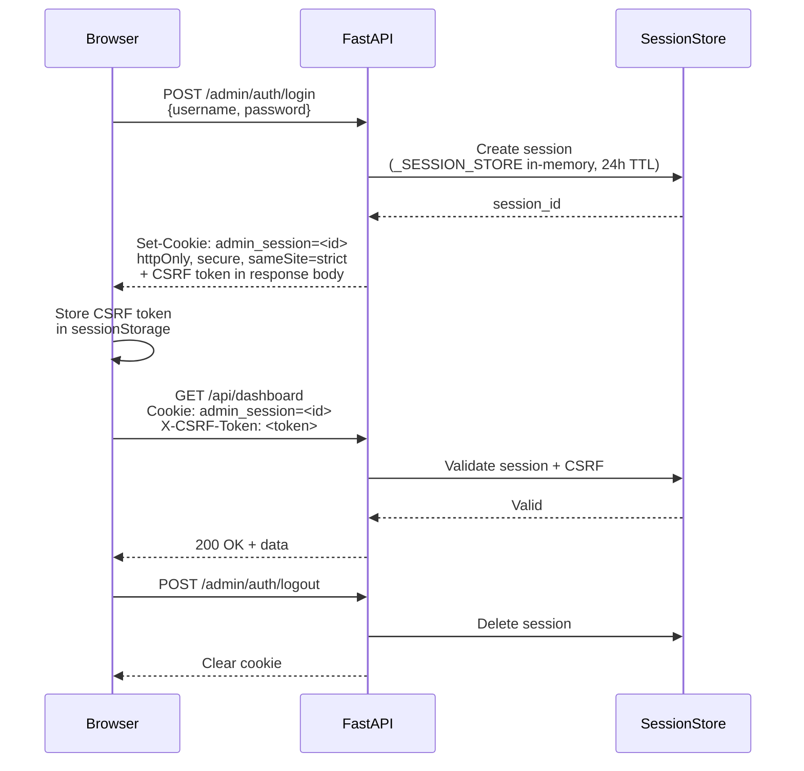

---

## 9. Data Sources & External APIs

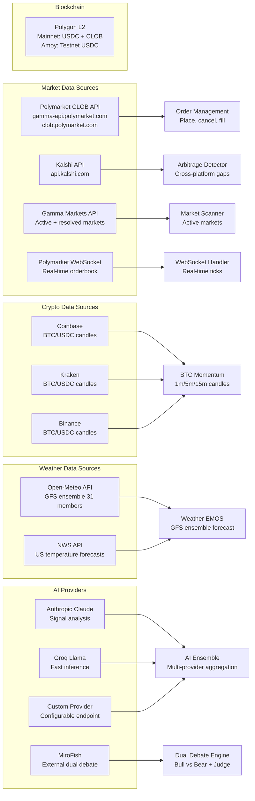

---

## 10. Database Schema (Key Tables)

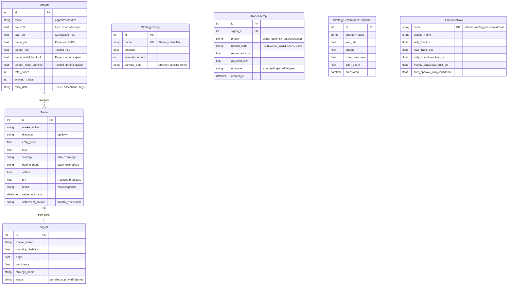

---

## 11. Job Queue Architecture (ADR-001)

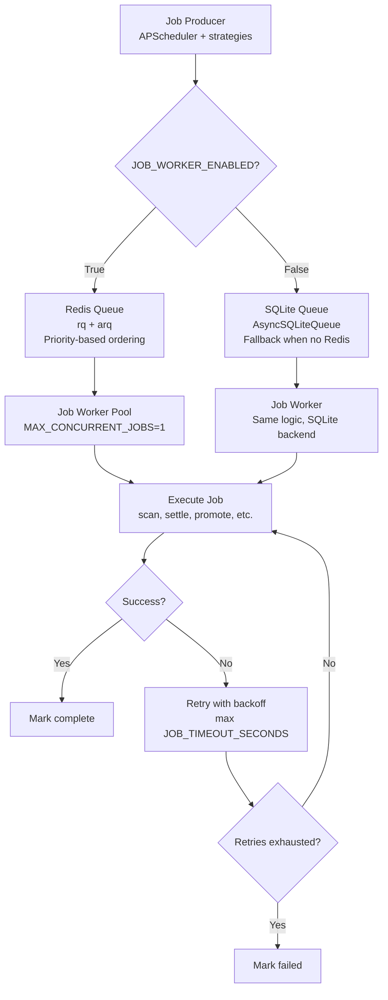

---

## 12. Risk Profiles (ADR-005)

```mermaid
flowchart LR
    subgraph Safe["Safe Profile"]
        S_KELLY[Kelly: 0.10]
        S_SIZE[Max Trade: $3]
        S_POS[Position: 3%]
        S_EXP[Exposure: 30%]
        S_LOSS[Daily Loss: $2]
        S_DD_D[Daily DD: 5%]
        S_DD_W[Weekly DD: 10%]
        S_CONF[Min Confidence: 70%]
    end
    
    subgraph Normal["Normal Profile (default)"]
        N_KELLY[Kelly: 0.30]
        N_SIZE[Max Trade: $8]
        N_POS[Position: 8%]
        N_EXP[Exposure: 70%]
        N_LOSS[Daily Loss: $5]
        N_DD_D[Daily DD: 10%]
        N_DD_W[Weekly DD: 20%]
        N_CONF[Min Confidence: 50%]
    end
    
    subgraph Aggressive["Aggressive Profile"]
        A_KELLY[Kelly: 0.50]
        A_SIZE[Max Trade: $20]
        A_POS[Position: 15%]
        A_EXP[Exposure: 85%]
        A_LOSS[Daily Loss: $15]
        A_DD_D[Daily DD: 20%]
        A_DD_W[Weekly DD: 35%]
        A_CONF[Min Confidence: 35%]
    end
    
    subgraph Extreme["Extreme Profile"]
        E_KELLY[Kelly: 0.80]
        E_SIZE[Max Trade: $50]
        E_POS[Position: 25%]
        E_EXP[Exposure: 95%]
        E_LOSS[Daily Loss: $40]
        E_DD_D[Daily DD: 40%]
        E_DD_W[Weekly DD: 60%]
        E_CONF[Min Confidence: 20%]
    end
    
    API[PUT /api/risk/profiles/:name<br/>Runtime editable] --> Safe
    API --> Normal
    API --> Aggressive
    API --> Extreme
    
    Safe --> APPLY[apply_profile()<br/>Overwrites runtime settings]
    Normal --> APPLY
    Aggressive --> APPLY
    Extreme --> APPLY
    
    APPLY --> SETTINGS[settings.KELLY_FRACTION<br/>settings.MAX_TRADE_SIZE<br/>settings.DAILY_DRAWDOWN_LIMIT_PCT<br/>settings.WEEKLY_DRAWDOWN_LIMIT_PCT<br/>etc.]
```

> **Note**: Risk profiles override the per-mode breaker toggles' *thresholds* but not their *enabled/disabled* state. Paper mode's `DRAWDOWN_BREAKER_ENABLED_PER_MODE=false` means the breaker is completely skipped regardless of profile.

---

## 13. Configuration Reference — Risk & Trading

| Variable | Default | Description |
|----------|---------|-------------|
| `ACTIVE_MODES` | `paper` | Comma-separated active trading modes |
| `INITIAL_BANKROLL` | `100.0` | Starting capital (paper/testnet) |
| `KELLY_FRACTION` | `0.30` | Kelly criterion fraction for sizing |
| `MAX_POSITION_FRACTION` | `0.08` | Max 8% of bankroll per trade |
| `MAX_TOTAL_EXPOSURE_FRACTION` | `0.70` | Max 70% total portfolio exposure |
| `DAILY_DRAWDOWN_LIMIT_PCT` | `0.10` | 10% daily drawdown threshold |
| `WEEKLY_DRAWDOWN_LIMIT_PCT` | `0.20` | 20% weekly drawdown threshold |
| `DAILY_LOSS_LIMIT` | `5.0` | $5 absolute daily loss limit |
| `MAX_TRADE_SIZE` | `8.0` | Maximum single trade size (live) |
| `PAPER_MIN_ORDER_USDC` | `1.0` | Minimum paper trade size |
| `MIN_ORDER_USDC` | `5.0` | Minimum live trade size |
| `AUTO_APPROVE_MIN_CONFIDENCE` | `0.50` | Auto-approve threshold |
| `MIN_EDGE_THRESHOLD` | `0.30` | 30% minimum edge to trade |
| `SLIPPAGE_TOLERANCE` | `0.02` | 2% max slippage |
| `DRAWDOWN_BREAKER_ENABLED_PER_MODE` | `paper: false, testnet/live: true` | Per-mode drawdown breaker toggle |
| `DAILY_LOSS_LIMIT_ENABLED_PER_MODE` | `paper: false, testnet/live: true` | Per-mode daily loss limit toggle |
| `RISK_PROFILE` | `normal` | Profile preset: safe/normal/aggressive/extreme |

---

## 14. Deployment Architecture

```mermaid
flowchart TD
    subgraph Railway["Railway (Backend)"]
        API2[FastAPI<br/>uvicorn<br/>Port 8000]
        WORKER2[Queue Worker<br/>PM2 managed]
        SCHEDULER2[Scheduler<br/>PM2 managed]
    end
    
    subgraph Vercel["Vercel (Frontend)"]
        FE[React SPA<br/>Vite build<br/>Static hosting]
    end
    
    subgraph Data_Infra["Data Infrastructure"]
        DB2[(SQLite<br/>Primary DB)]
        REDIS2[(Redis<br/>Optional queue<br/>Falls back to SQLite)]
    end
    
    subgraph External["External Services"]
        POLY2[Polymarket CLOB<br/>+ Data API]
        KALS2[Kalshi API]
        CLAUDE2[Anthropic Claude]
        GROQ2[Groq API]
    end
    
    FE -->|REST API| API2
    API2 --> DB2
    API2 --> REDIS2
    WORKER2 --> REDIS2
    WORKER2 --> DB2
    SCHEDULER2 --> DB2
    API2 --> POLY2
    API2 --> KALS2
    SCHEDULER2 --> CLAUDE2
    SCHEDULER2 --> GROQ2
    
    subgraph PM2_Processes["PM2 Process Manager"]
        P1[API Server<br/>ecosystem.config.js]
        P2[Queue Worker<br/>ecosystem.config.js]
        P3[Scheduler<br/>ecosystem.config.js]
    end
    
    PM2_Processes --> Railway
```

---

## 15. Circuit Breaker Pattern

```mermaid
stateDiagram-v2
    [*] --> Closed: Normal operation
    
    Closed --> Open: failure_threshold<br/>consecutive failures reached
    Open --> HalfOpen: recovery_timeout<br/>elapsed (default 60s)
    HalfOpen --> Closed: Probing call<br/>succeeds
    HalfOpen --> Open: Probing call<br/>fails
    
    note right of Closed: All requests pass through<br/>Failure count resets on success
    note right of Open: All requests fail immediately<br/>No external API calls
    note right of HalfOpen: Single probing request<br/>If success → close circuit<br/>If failure → re-open
```

Each external API (Polymarket CLOB, Kalshi, Groq, Claude) has its own `CircuitBreaker` instance. See `backend/core/circuit_breaker.py`.

---

## 16. Error Handling & Resilience

```mermaid
flowchart TD
    REQ[API Request] --> CB{Circuit Breaker<br/>for this service}
    CB -->|Closed| API2[External API Call]
    CB -->|Open| FAIL[Fail Fast<br/>Return cached/error]
    CB -->|HalfOpen| PROBE[Single Probe Request]
    
    API2 --> RESULT{Success?}
    PROBE --> RESULT
    
    RESULT -->|Yes| RESET[Reset failure count<br/>Close circuit if half-open]
    RESULT -->|No, retryable| RETRY[Retry with exponential<br/>backoff + jitter<br/>see backend/core/retry.py]
    RESULT -->|No, permanent| FAIL2[Return error<br/>Increment failure count]
    
    RETRY --> API3[Retry attempt]
    API3 --> RESULT2{Success?}
    RESULT2 -->|Yes| RESET
    RESULT2 -->|No, max retries| FAIL3[Mark circuit open]
    
    FAIL3 --> CB2[Open circuit for<br/>recovery_timeout seconds]
```

---

## 17. Trade Attempt Observability (ADR-003)

```mermaid
flowchart LR
    SIGNAL[Signal generated] --> GATE[Signal Gate<br/>confidence >= threshold?]
    GATE -->|No| ATTEMPT1[TradeAttempt<br/>phase=signal_gate<br/>reason=REJECTED_CONFIDENCE<br/>outcome=skipped]
    GATE -->|Yes| RISK[Risk Gate<br/>RiskManager.validate_trade]
    
    RISK -->|Rejected| ATTEMPT2[TradeAttempt<br/>phase=risk_gate<br/>reason=REJECTED_DRAWDOWN_BREAKER<br/>or REJECTED_DAILY_LOSS etc.<br/>outcome=rejected]
    RISK -->|Approved| EXEC2[Execution<br/>StrategyExecutor]
    
    EXEC2 --> ATTEMPT3[TradeAttempt<br/>phase=execution<br/>requested_size vs adjusted_size<br/>outcome=executed/failed]
    
    ATTEMPT1 --> DASH2[Dashboard Control Room<br/>Explains why no trade was made<br/>without mutating historical Trade rows]
    ATTEMPT2 --> DASH2
    ATTEMPT3 --> DASH2
```

> **Critical Rule**: TradeAttempt rows are never mutated. Historical `Trade` rows are never rewritten to explain rejected attempts. See `docs/architecture/adr-003-trade-attempt-observability.md`.

---

## 18. Notification & Alerting

```mermaid
flowchart TD
    EVENT[Event Bus<br/>publish_event] --> ROUTER[notification_router.py]
    
    ROUTER --> TELEGRAM[Telegram Bot<br/>High-confidence signals<br/>Trade executions<br/>Settlement alerts]
    ROUTER --> DISCORD[Discord Webhook<br/>Optional notifications]
    ROUTER --> SSE2[SSE Stream<br/>/api/events/stream<br/>Real-time dashboard updates]
    
    subgraph Alert_Types["Alert Types"]
        TRADE_ALERT[Trade executed<br/>Signal approved/rejected]
        SETTLE_ALERT[Trade settled<br/>P&L result]
        HEALTH_ALERT[Strategy health<br/>killed/warned status]
        REGIME_ALERT[Regime change<br/>Bull/Bear/Sideways/Volatile]
        ERROR_ALERT[API failures<br/>Circuit breaker trips]
    end
    
    Alert_Types --> ROUTER
```

---

## 19. Key Architectural Decisions

| ADR | Title | Decision |
|-----|-------|----------|
| ADR-001 | Job Queue | Redis preferred with SQLite fallback; idempotency keys prevent duplicate processing |
| ADR-002 | Live Equity Source | Live `BotState.bankroll` from external CLOB+Data API, never recomputed from local ledger |
| ADR-003 | Trade Attempt Observability | Separate `TradeAttempt` ledger for rejected/failed attempts; never mutate `Trade` rows |
| ADR-004 | Bounded Autonomous Sizing | Strategy/AI may propose dynamic sizes, but `RiskManager` mandates and minimum-order gates are non-bypassable |
| ADR-005 | Risk Profiles | Four presets (safe/normal/aggressive/extreme) override all thresholds at runtime via API |
| ADR-006 | AGI Autonomy Framework | Paper→Live promotion requires human approval unless `AGI_AUTO_PROMOTE=true`; health-based kill checks are automatic |

---

## 20. Testing Strategy

```mermaid
flowchart TD
    subgraph Unit_Tests["Unit Tests (pytest)"]
        RM_TEST[test_risk_manager.py<br/>Drawdown, position, exposure]
        AT_TEST[test_auto_trader.py<br/>Signal routing, confidence]
        SE_TEST[test_strategy_executor.py<br/>Paper vs live execution]
        CB_TEST[test_circuit_breaker.py<br/>State transitions]
        SET_TEST[test_settlement.py<br/>P&L calculation, outcomes]
    end
    
    subgraph Integration_Tests["Integration Tests"]
        ORC[test_orchestrator_wiring.py<br/>Full startup with mocks]
        API_TEST[test_api_health.py<br/>HTTP endpoint tests]
    end
    
    subgraph E2E_Tests["E2E Tests (Playwright)"]
        FE_TEST[frontend/e2e/<br/>Dashboard interactions]
    end
    
    Unit_Tests --> RUN[pytest backend/tests/ -v]
    Integration_Tests --> RUN
    E2E_Tests --> RUN2[cd frontend && npx playwright test]
```

### Test Commands

```bash
# Backend unit tests
pytest backend/tests/ -v

# Specific test file
pytest backend/tests/test_risk_manager.py -v

# Frontend unit tests
cd frontend && npm test

# E2E tests
cd frontend && npx playwright test

# Type check
cd frontend && npx tsc --noEmit

# Build check
cd frontend && npx vite build

# Never run live trading tests without SHADOW_MODE=true
```